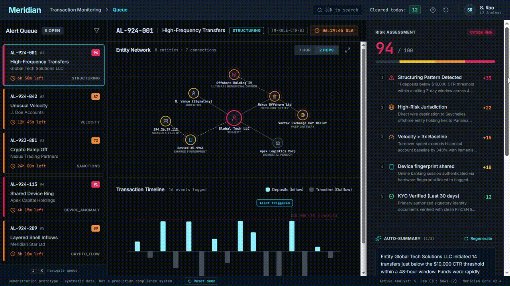

# Meridian - AML Alert Triage Console

An interaction design prototype exploring how compliance analysts review, justify,
and dispose of anti-money-laundering alerts.

**[Live demo →]([https://meridian-aml.vercel.app/])**

---

## The problem

The overwhelming majority of alerts generated by bank transaction-monitoring systems
are false positives. Analysts work through queues of them under SLA pressure, and for
every alert they close they must record a rationale that will withstand regulatory
scrutiny sometimes years later.

So the hard problem isn't scoring risk. Models already do that. The hard problem is
showing an analyst *why the system flagged this*, in a form they can verify and
defend, fast enough to clear a full queue in a shift.

Meridian is a prototype interface for that specific problem.

---

## Core interaction: signals linked to evidence

The risk score is decomposed into weighted, individually-inspectable signals.
Hovering any signal dims everything unrelated and highlights precisely the evidence
that produced it, the deposits that fell below the reporting threshold, the shared
device fingerprint, the offshore counterparty. The link works in both directions:
selecting an entity in the graph reveals which signals it contributes to.

An analyst never has to take the score on trust. Every point of it traces to
something they can see.

---

## Design decisions

**Scores are decomposed, never atomic.** A single "94/100" is unusable in a
regulated workflow because it can't be argued with. Seven weighted signals can be
individually accepted or rejected.

**One signal carries negative weight.** Verified KYC documentation *reduces* the
score. A system that only ever accumulates risk is a system that produces the false
positives analysts are drowning in, modelling a mitigating factor was a deliberate
choice about what the tool is for.

**Rationale is mandatory before any disposition.** All three actions stay disabled
until 50 characters are entered. The audit trail is not an afterthought bolted on
after the decision; it's a precondition of making one.

**Freeze cannot be undone; Clear and Escalate can.** Reversibility is matched to
real-world consequence. Freezing a customer's accounts has effects outside the
system, so it requires typed confirmation of the account ID and offers no undo.

**Graph layout is deterministic.** Node positions are fixed rather than
force-simulated, so the same case always looks the same. Analysts build spatial
memory of cases they revisit; a layout that reshuffles on every load destroys that.

**Keyboard-first.** J/K to move through the queue, C/E/F for dispositions.
Queue-based work is repetitive volume work, and repetitive volume work belongs
on the keyboard.

**Risk is never communicated by colour alone.** Every risk level carries an icon
and a text label alongside its colour (WCAG 1.4.1).

---

## Build notes

React · TypeScript · Tailwind · hand-built SVG for the entity graph and transaction
timeline.

The interface makes **zero network requests**. All analysis output is pre-authored
and surfaced through a simulation layer - staged reveals, variable-latency
typewriter output, deterministic layout. This was a deliberate choice: a portfolio
prototype that depends on a live model API is a prototype that can fail during the
thirty seconds someone is looking at it, and shipping a public demo with an embedded
API key is a security problem, not a feature.

---

## What I'd build next

- **Analyst feedback loop into rule tuning** - dispositions are the highest-quality
  training signal a monitoring system has, and most platforms discard them
- **Case linking across alerts** - the same entity surfacing in three alerts is
  itself a signal
- **314(b) information-sharing request flow** - the point at which triage stops
  being a single-institution problem
- **Narrative drafting for SAR filing**, with the analyst's rationale as the seed

---

## Disclaimer

Demonstration prototype. All entities, transactions, and identifiers are synthetic.
Not a production compliance system and not a source of regulatory guidance.